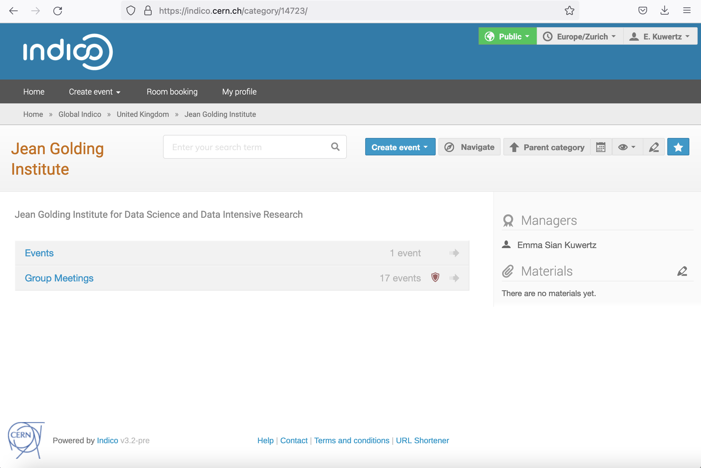

(indico)=
# Indico

The Ask-JGI weekly meetings are managed through
[indico](https://indico.cern.ch/). 

### Navigating indico

You should be able to locate the Jean Golding Institute indico agendas
directly,
[here](https://indico.cern.ch/category/14723/). Alternatively, you can
navigate to this category from the indico home page by selecting: 
`Global indico` &rarr; `United Kingdom` &rarr; `Jean Golding
Institute`.

### Creating an indico account

If you are new to indico, you can create an account using your [GitHub](https://github.com/)
credentials. If you don't have a GitHub account, we recommend you get one!
It is definitely going to be useful if you're working in the data
science domain. Follow the instructions [here](https://github.com/join) to join GitHub.

To create your indico account using your GitHub credentials, simply follow the instructions below:

1.  Navigate to the [indico homepage](https://indico.cern.ch/) and
select the login icon in the top right corner of the screen, as
illustrated below.
    
      
2.  You will then be greeted with the below sign in page. If you do
not already have an indico account then the easiest thing to do is to
sign in using your GitHub credentials. To sign into indico using your
GitHub credentials, select the GitHub icon listed under the option `Or sign in with a social account`.
    
      
3.  Once you select this option you will be directed to the following
sign in page. Enter your GitHub credentials here and you will be able
to create your indico profile.
    
      

