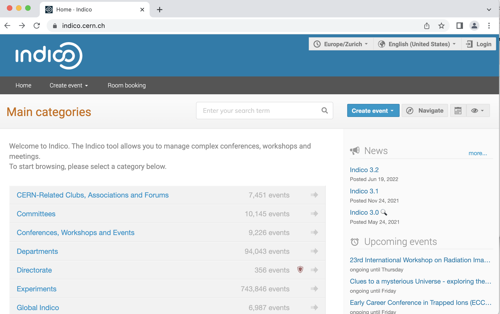
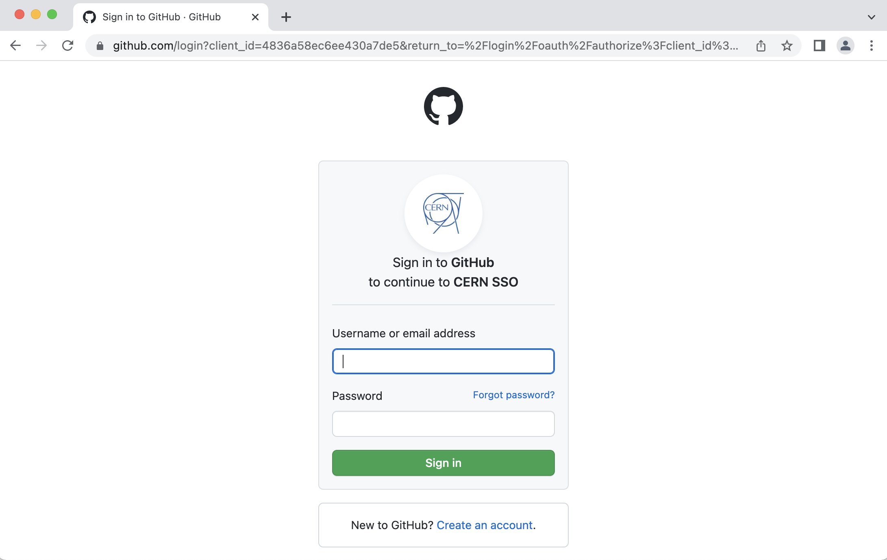

(indico)=
# Indico

The Ask-JGI weekly meetings are managed through
[indico](https://indico.cern.ch/). 

In this handbook section you can find information on the following:
- How to [find Ask-JGI meetings](whereami_indico) on indico.
- How to [set up an indico account](account).
- How to [grant a new team member access](indico_access) to the Ask-JGI Group Meeting
  agendas on indico.

(whereami_indico)=
## Navigating indico

You should be able to locate the Jean Golding Institute indico agendas
directly under `Group Meetings` [here](https://indico.cern.ch/category/14723/). Alternatively, you can
navigate to this category from the indico home page by selecting: 
`Global indico` &rarr; `United Kingdom` &rarr; `Jean Golding
Institute`. 

You should be able to view the Jean Golding
Institute indico category whether you have an indico account or
not. The top level category page will look something like the
screenshot below.

  

Notice in the image above the red security shield next to the `Group
Meetings` category. This indicates that this is a protected category
(i.e. the agendas under this category **are not public**). The same is
not true of the `Events` category, which **is public**. 

In order to be able to view the protected `Group Meetings` category
you will need to [create an indico account](account), and you will need one of
the JGI indico managers to [add your account to the access list](indico_access) for the
`Group Meetings` category. 

(account)=
## Creating an indico account

If you are new to indico, you can create an account using your [GitHub](https://github.com/)
credentials. If you don't have a GitHub account, we recommend you get one!
It is definitely going to be useful if you're working in the data
science domain. Follow the instructions [here](https://github.com/join) to join GitHub.

To create your indico account using your GitHub credentials, simply follow the instructions below:

1.  Navigate to the [indico homepage](https://indico.cern.ch/) and
select the login icon in the top right corner of the screen, as
illustrated below.
    
      
2.  You will then be greeted with the below sign in page. If you do
not already have an indico account then the easiest thing to do is to
sign in using your GitHub credentials. To sign into indico using your
GitHub credentials, select the GitHub icon listed under the option `Or sign in with a social account`.
    
      
3.  Once you select this option you will be directed to the following
sign in page. Enter your GitHub credentials here and you will be able
to create your indico profile.
    
      

(indico_access)=
## Managing access on indico

:::{important}
These instructions are for **managers**.
:::

When a new member joins the Ask-JGI team, one of the JGI indico
managers will need to add the new member's indico account to the
access list for the `Group Meetings` [indico
category](https://indico.cern.ch/category/14729/). This can be done by
someone with manage access to the JGI indico. 

**For managers:** follow the instructions below to add a new member to
the `Group Meetings` indico category:

1.  Navigate to the Jean Golding Institute Group Meetings [indico
   category](https://indico.cern.ch/category/14729/) and select the
   `Manage category` icon, as shown in the image below. This will
   direct you to the management area of the `Group Meetings` indico category.
    
      
2.  Once you have switched to the management area, select `Protection`
   on the left hand navigation menu. This will take you to the
   category protection settings. You will be able to see the list of
   users who currently have access (the usernames and emails are
   redacted in the image below). Select the option to add a user by
   clicking the `User` icon at the
   bottom of the list of existing users.
    
      
3.  Selecting the add user option will open a window like that shown
    in the image below. Here you should be able to search for the
    member that you want to grant access to. Note that the user will
    need to have already registered for an indico account in order for
    this to work. 
    
      
4.  Don't forget to save your changes. You should then be able to see
    the new member listed in the access list, and they should be able
    to access the group meeting agendas when they are signed in to indico.
